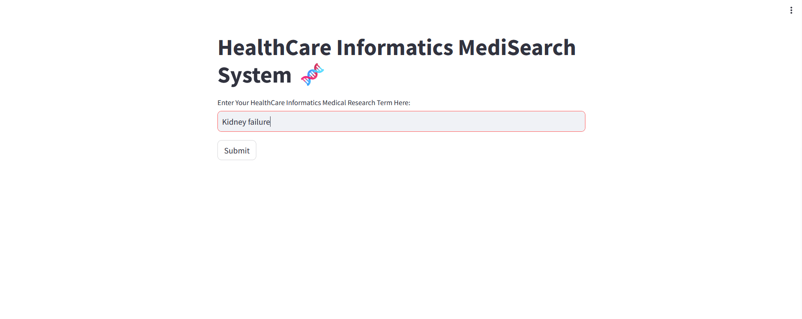
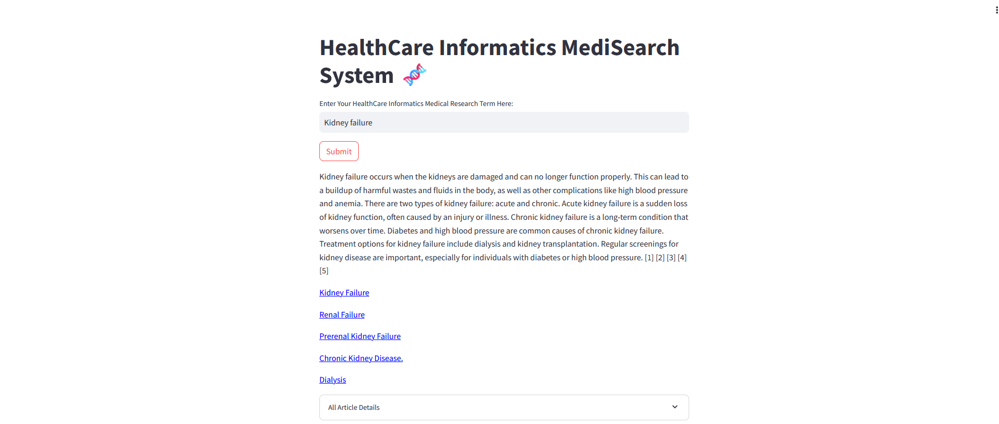

🚀Check out the configuration reference at https://huggingface.co/docs/hub/spaces-config-reference

Spaces & Working 🔗

🥤Huggingface Branch : https://huggingface.co/spaces/prithivMLmods/HealthCare-Informatics-MediSearch/tree/main

🥤To Get Medi_Search API Key LogIn to : https://medisearch.io/developers/admin

🥤HuggingFace Space Link : https://huggingface.co/spaces/prithivMLmods/HealthCare-Informatics-MediSearch

ℹ️Generated Result in Huggingface Spaces:

ℹ️Provide the Medical Term & Submit Process 

Output Sample 

.

.

.
